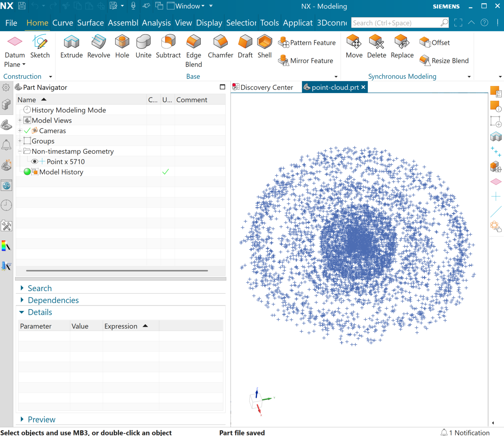

<!-- Copyright 2026 Commonwealth Fusion Systems (CFS), all rights reserved. -->
<!-- This entire source code file represents the sole intellectual property of CFS. -->
<!--  -->
<!-- Licensed under the Apache License, Version 2.0 (the "License"); -->
<!-- you may not use this file except in compliance with the License. -->
<!-- You may obtain a copy of the License at -->
<!--  -->
<!--     http://www.apache.org/licenses/LICENSE-2.0 -->
<!--  -->
<!-- Unless required by applicable law or agreed to in writing, software -->
<!-- distributed under the License is distributed on an "AS IS" BASIS, -->
<!-- WITHOUT WARRANTIES OR CONDITIONS OF ANY KIND, either express or implied. -->
<!-- See the License for the specific language governing permissions and -->
<!-- limitations under the License. -->
# Nxlib Example Project

This is an example project showing how nxlib is typically used to extract data from NX models using the NXOpen Python API. The general pattern that's used is as follows:

1. Define a structure for the data that comes from NX.
2. Open an NX model and serialize the data.
3. Perform post-processing on the serialized data.

## Problem Statement: A hidden message
A mysterious engineer from [CFS](https://cfs.energy) has left us an NX .prt file, and we suspect there is a hidden message in it. We open the file, and it's just a bunch of random points. No matter what way we look at it, we can't seem to make heads or tails out of it. 



We do know that CFS likes to work in [poloidal coordinates](https://en.wikipedia.org/wiki/Toroidal_and_poloidal_coordinates) because they ~~eat a lot of donuts over there~~ [are making a donut-shaped device](https://cfs.energy/technology/sparc), so maybe if we converted each point from cartesian to poloidal coordinates we'd learn something. Let's give it a try.

## Solution
We'll walk through the steps to unravel this mystery one by one. All of the code in this example repository should be runnable on a Windows machine with a working NX installation.

### Step Zero: Project and nxlib setup
We use [uv](https://docs.astral.sh/uv/) to package and manage our Python projects. If you don't already have uv, we recommend getting it setup on your system prior to proceeding.

The first step is to clone the repository and move into the example directory:
```powershell
git clone git@github.com:cfs-energy/nxlib.git
cd nxlib/example
```

Now we'll install the example project with uv, and make sure that the NX Python interpreter can see nxlib:
```powershell
uv sync  # Creates a virtual environment and installs all dependencies, including nxlib
uv run nxlib install  # Symbolically link the nxlib installation to the NX interpreter path
```

If all of that went well, you should be able to run
```powershell
uv run nxlib status
```
and see that nxlib has been successfully symlinked.

## Step One: Define the structure for the data that comes from NX.
Since we'll only be extracting points, we can extract them to a JSON file. While this approach is more data-intensive than a simple CSV, it does showcase how more complex geometric elements can be extracted & serialized from NX. The resulting data will look like this:
```json
{
  "points": [
    {
      "coords": [ 12.454430467617625, 15.648870940974554, 99.0 ],
      "_type": "Point3d"
    },
    // ...
  ]
}
```

## Step Two: Get the data from NX.
The code that NX runs is in [nx_get_points.py](nx_get_points.py). It's standard practice to prefix NX journals with `nx_` so we know they're separate from regular Python code. You'll note that this file does import from `nxlib.nxopen`, so trying to run it in our local environment will raise an error when it tries to eventually `import NXOpen`.

We can use [`argparse`](https://docs.python.org/3.10/library/argparse.html) on our NX Journal to pass in command line arguments. This creates a clean & flexible interface with the [main script](main.py) for calling the journal.

### Step Three: Analyze and vizualize the data with third party libraries.
Now that we've serialized the data, we can perform the transformation from cartesian to poloidal coordinates using numpy, and plot the result using matplotlib. [main.py](main.py) acts as the singular entry point for the entire project, as it calls the `run_journal` function to execute the journal. Everything happens headlessly without needing to manually execute the journal through the GUI.

## Putting it all together
We can run the script and see the [result](assets/result.png) with a single command:
```powershell
uv run python main.py assets/point-cloud.prt result.png --preview
```
If everything is working correctly, you should see the secret message open as an image on your computer.

While this example is at the same time simple and contrived, it does show how we typically build complex workflows that involve NX journals. The strength of nxlib is the capability to seamlessly integrate NX journals to solve complex problems that can't be done within NX alone.